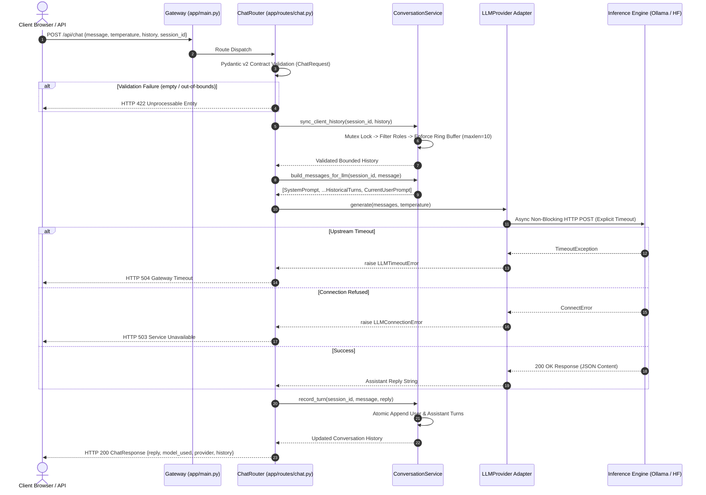

<div align="center">

# ☀️ SUN-LLM
### Autonomous Multi-Turn Inference Engine & Bounded Context Orchestrator

[](https://python.org)
[](https://fastapi.tiangolo.com)
[](https://docs.pydantic.dev)
[](docs/Architecture.md)
[%20Ring%20Buffer-success.svg?style=for-the-badge)](#bounded-context-memory-subsystem)
[-brightgreen.svg?style=for-the-badge&logo=pytest&logoColor=white)](tests/)
[](Dockerfile)
[](LICENSE)

<p align="center">
  <b>A zero-cost, privacy-first, enterprise-hardened conversational runtime engineered for open-weight Large Language Models.</b><br>
  Featuring asynchronous non-blocking I/O, polymorphic provider abstraction (Ollama & Hugging Face), deterministic context bounding, and a defensive HTTP security gateway.
</p>

</div>

---

## 📑 Table of Contents

- [1. Executive Technical Overview](#1-executive-technical-overview)
- [2. Architectural Specifications & Data Plane](#2-architectural-specifications--data-plane)
- [3. Deep Technical Differentiators](#3-deep-technical-differentiators)
- [4. Mathematical Foundations & Context Engineering](#4-mathematical-foundations--context-engineering)
- [5. Polymorphic LLM Provider Architecture](#5-polymorphic-llm-provider-architecture)
- [6. Defensive Gateway & RFC Error Mapping](#6-defensive-gateway--rfc-error-mapping)
- [7. Repository Topology](#7-repository-topology)
- [8. Runtime Configuration Matrix](#8-runtime-configuration-matrix)
- [9. Quickstart & Deployment Vectors](#9-quickstart--deployment-vectors)
  - [Bare-Metal Local Setup](#bare-metal-local-setup)
  - [Containerized Deployment (OCI / Docker)](#containerized-deployment-oci--docker)
- [10. REST API Specification](#10-rest-api-specification)
- [11. Verification & Offline Test Suite](#11-verification--offline-test-suite)
- [12. Educational NLP Subsystems (Notebooks)](#12-educational-nlp-subsystems-notebooks)
- [13. Production Hardening & High Availability](#13-production-hardening--high-availability)
- [14. Internship Engineering Context](#14-internship-engineering-context)
- [15. License](#15-license)

---

## 1. Executive Technical Overview

Most conversational generative AI applications suffer from architectural fragility: proprietary API vendor lock-in (OpenAI, Anthropic, Google Gemini), unbounded session state inflation causing catastrophic memory exhaustion, raw traceback leakage during upstream degradation, and uncoupled testing environments that require live billing credentials to execute.

**SUN-LLM** resolves these challenges by introducing an **industrial-grade, zero-cost reference runtime** that treats local and open-weight models as first-class citizens. Built upon **FastAPI**, **HTTPX (Async)**, and **Pydantic v2**, SUN-LLM enforces:
- **Zero-Trust Input Pipeline:** Pre-runtime validation, strict payload clamping, and role whitelisting.
- **$\mathcal{O}(1)$ Memory Upper Bound:** Deterministic sliding ring buffers preventing context blowout.
- **Provider Agnosticism:** Dynamic swapping between local daemons (**Ollama**) and cloud endpoints (**Hugging Face Inference**) via zero-downtime environment switches.
- **100% Offline CI Determinism:** High-speed unit and integration tests executing completely decoupled from the public internet.

---

## 2. Architectural Specifications & Data Plane

The system utilizes an inverted, hexagonal dependency architecture where HTTP routing and provider infrastructure depend inward on abstract domain contracts:

```
+-------------------------------------------------------------------------------+
|                             CLIENT / USER SURFACE                             |
|        Web Browser (Dark-Mode UI)       |       Automated HTTP / REST Client  |
+-------------------------------------------------------------------------------+
                                      │  ▲
              HTTP GET / (HTML UI)   │  │  HTTP POST /api/chat (JSON)
                                      ▼  │
+-------------------------------------------------------------------------------+
|                       DEFENSIVE HTTP GATEWAY (PRESENTATION)                   |
|   FastAPI Application Factory (app/main.py)                                   |
|   ├── Lifespan Context Manager (Structured Startup / Shutdown Diagnostics)     |
|   ├── Resolved Path Jinja2 Template Renderer (XSS-Safe Context Binding)       |
|   └── Global Sanitizing Exception Handlers (Traceback Shielding)              |
+-------------------------------------------------------------------------------+
                                      │  ▲
             Dependency Injection     │  │  Pydantic v2 Validation
             (get_provider, etc.)     ▼  │  (ChatMessage, ChatRequest)
+-------------------------------------------------------------------------------+
|                        ROUTER CONTROLLER (app/routes/chat.py)                 |
|   ├── POST /api/chat: Contract Verification & Upstream Translation            |
|   └── GET /health: Decoupled Liveness & Upstream Daemon Diagnostic Probe      |
+-------------------------------------------------------------------------------+
                     │                                       │
                     ▼                                       ▼
+-----------------------------------------+   +---------------------------------+
|      DOMAIN & CONTEXT SERVICES          |   |   POLYMORPHIC PROVIDER FACTORY  |
|   (app/services/conversation.py)        |   |   (app/services/llm/__init__.py)|
|   ├── Mutex-Guarded Session Registry    |   +---------------------------------+
|   ├── collections.deque(maxlen=K)       |                   │
|   ├── Role Whitelisting (user/assistant)|                   ▼
|   └── Immutable System Prompt Injection |   +---------------------------------+
+-----------------------------------------+   |       LLMProvider INTERFACE     |
                                              |   (app/services/llm/base.py)    |
                                              +---------------------------------+
                                                              │
                                       ┌──────────────────────┴──────────────────────┐
                                       ▼                                             ▼
                        +-----------------------------+               +-----------------------------+
                        |       OllamaProvider        |               |     HuggingFaceProvider     |
                        | (app/services/llm/ollama.py)|               | (services/llm/huggingface.py|
                        +-----------------------------+               +-----------------------------+
                                       │                                             │
                                       ▼ (Async HTTP)                                ▼ (Async HTTP)
                        +-----------------------------+               +-----------------------------+
                        |  Local Daemon (:11434)      |               |  Hugging Face Serverless    |
                        |  Mistral / LLaMA 3 / Phi    |               |  v1/chat/completions Router |
                        +-----------------------------+               +-----------------------------+
```

### Complete End-to-End Sequence Diagram



---

## 3. Deep Technical Differentiators

| Dimension | Typical Prototype Implementation | SUN-LLM Production Runtime |
| :--- | :--- | :--- |
| **Concurrency & Threading** | Synchronous requests, blocking global state | 100% Async Non-Blocking (`async`/`await`), thread-safe mutex guards |
| **Context Memory Bounds** | Unbounded list growth $\to$ Out-Of-Memory (OOM) | Strict $\mathcal{O}(1)$ sliding window via `collections.deque(maxlen=K)` |
| **Provider Coupling** | Direct `requests.post()` in route handlers | Polymorphic `LLMProvider` contract with dynamic factory instantiation |
| **Error Handling** | Unhandled exceptions $\to$ raw stack trace exposure | RFC 9110 mapped domain exceptions (`504`, `503`, `502`, `500`) |
| **Frontend Security** | Vulnerable `element.innerHTML` output | XSS-immune DOM text nodes via `document.createElement` & `textContent` |
| **CI / Testing Strategy** | Requires live model daemons and API keys | 26/26 unit tests run 100% offline via HTTPX `MockTransport` in < 0.5s |
| **Container Security** | Runs as root user with default caches | Dedicated non-root `appuser` (UID 1000), multi-stage, internal health probes |

---

## 4. Mathematical Foundations & Context Engineering

### 4.1 Temperature-Scaled Softmax Sampling
When interacting with generative decoder models, sampling randomness is governed by the temperature parameter $T \in [0.0, 2.0]$. The logits vector $z \in \mathbb{R}^{|V|}$ produced by the language model's final linear projection is scaled before computing token probabilities:

$$P(w_i \mid w_{<i}) = \frac{\exp\left(\frac{z_i}{T}\right)}{\sum_{j=1}^{|V|} \exp\left(\frac{z_j}{T}\right)}$$

- **As $T \to 0$:** The distribution approaches a Dirac delta function centered at $\arg\max_i(z_i)$ (greedy deterministic decoding).
- **As $T \to 2.0$:** The entropy of the distribution increases, yielding maximum creativity while maintaining lexical bounds.
- **SUN-LLM Guarantee:** `ChatRequest` validates $0.0 \le T \le 2.0$. The Hugging Face provider clamps extreme zero values to $\max(0.01, T)$ to avoid division-by-zero singularities on remote engines.

### 4.2 Bounded Ring Buffer Memory Complexity
Let $K = \text{MAX\_HISTORY\_MESSAGES}$ (default $10$). For any session $s$, the storage consumption $S(n)$ after $n$ conversation turns satisfies:

$$S(n) \le K \times L_{\max} = \mathcal{O}(1)$$

where $L_{\max} = 10{,}000$ characters is the strict per-message payload limit enforced by [`app.models.ChatMessage`](file:///c:/Users/Sajid/Downloads/20556486-5071279-Code-20260324T103404Z-1-001/app/models.py). The oldest turns are evicted in amortized $\mathcal{O}(1)$ time complexity using CPython's doubly-linked circular buffer implementation (`collections.deque`).

---

## 5. Polymorphic LLM Provider Architecture

All inference backends conform to the abstract interface defined in [`app/services/llm/base.py`](file:///c:/Users/Sajid/Downloads/20556486-5071279-Code-20260324T103404Z-1-001/app/services/llm/base.py):

```python
class LLMProvider(ABC):
    @property
    @abstractmethod
    def provider_name(self) -> str: ...

    @property
    @abstractmethod
    def model_name(self) -> str: ...

    @abstractmethod
    async def generate(self, messages: list[ChatMessage], temperature: float) -> str: ...

    @abstractmethod
    async def check_health(self) -> dict[str, Any]: ...
```

### 1. Ollama Provider (`app/services/llm/ollama.py`)
- Interfaces with local or remote Ollama daemons over asynchronous HTTP.
- Queries `/api/chat` using native non-streaming payloads (`stream: False`).
- Executes diagnostic liveness checks against `/api/tags` to verify whether the configured model (e.g., `mistral`, `llama3`) is physically pulled and ready.
- Detects and translates in-payload error envelopes (`{"error": "..."}`) into structured exceptions.

### 2. Hugging Face Provider (`app/services/llm/huggingface.py`)
- Interfaces with modern Hugging Face Serverless / Dedicated inference routers.
- Conforms strictly to the OpenAI-compatible `/v1/chat/completions` payload specification.
- Handles model cold-starts: catches HTTP 503 states containing `estimated_time` and reports actionable wait estimates.
- Enforces Bearer token authentication without ever exposing `HF_TOKEN` in client responses or telemetry.

---

## 6. Defensive Gateway & RFC Error Mapping

SUN-LLM isolates internal engine faults and maps domain exceptions to RFC 9110 HTTP status codes:

```
+------------------------------------+--------------------------+------------------------------------------------------------+
| Domain Exception                   | HTTP Status Code         | Client-Facing Detail Guarantee                             |
+------------------------------------+--------------------------+------------------------------------------------------------+
| Pydantic ValidationError           | 422 Unprocessable Entity | Exact field path (e.g. empty string, temp out of bounds)  |
| LLMTimeoutError                    | 504 Gateway Timeout      | Clean timeout notification; zero traceback exposure       |
| LLMConnectionError                 | 503 Service Unavailable  | Upstream daemon unreachable; instructs to check Ollama host|
| LLMModelNotFoundError              | 502 Bad Gateway          | Explicit notification that model tag does not exist        |
| LLMAuthenticationError             | 502 Bad Gateway          | Token rejection notice; credentials sanitized              |
| LLMConfigurationError              | 500 Internal Error       | Server-side env error; zero token disclosure               |
| Unhandled Server Exception         | 500 Internal Error       | Generic shield; full stack logged internally only          |
+------------------------------------+--------------------------+------------------------------------------------------------+
```

---

## 7. Repository Topology

```text
llm-prompt-project/
├── app/
│   ├── __init__.py                # Package identity and semver metadata
│   ├── main.py                    # Application factory, lifespan hooks, UI routes
│   ├── config.py                  # Immutable Settings dataclass with @lru_cache
│   ├── models.py                  # Pydantic v2 schemas: ChatMessage, ChatRequest, Health
│   │
│   ├── routes/
│   │   ├── __init__.py
│   │   └── chat.py                # REST endpoints: POST /api/chat, GET /health
│   │
│   ├── services/
│   │   ├── __init__.py
│   │   ├── conversation.py        # Thread-safe ring buffer context manager
│   │   │
│   │   └── llm/
│   │       ├── __init__.py        # Factory method get_llm_provider()
│   │       ├── base.py            # Abstract Base Class & Exception taxonomy
│   │       ├── ollama.py          # Native Ollama HTTP adapter
│   │       └── huggingface.py     # OpenAI-compatible Hugging Face adapter
│   │
│   └── prompts/
│       └── system.txt             # Immutable base system instruction prompt
│
├── templates/
│   └── index.html                 # Accessible dark-mode chat UI with XSS-safe text nodes
│
├── tests/
│   ├── __init__.py
│   ├── test_health.py             # UI serving and health probe test cases
│   ├── test_chat.py               # Input validation and RFC error mapping tests
│   ├── test_conversation.py       # Memory bounding, session isolation, role filtering
│   └── test_providers.py          # Direct provider mock transport unit tests
│
├── notebooks/                     # Isolated educational NLP laboratory
│   ├── module_6_part_1.ipynb      # NLTK tokenization, stopwords, WordNet lemmatization
│   ├── module_6_part_2.ipynb      # Bag-of-Words & TF-IDF statistical vectorization
│   └── module_6_part_3.ipynb      # Sentiment classification pipeline with Gradio UI
│
├── docs/
│   ├── PRD.md                     # Product Requirements Document
│   ├── Architecture.md            # Deep architecture specifications & Mermaid diagrams
│   ├── Rules.md                   # Engineering standards for developers & AI coding agents
│   ├── Phases.md                  # Complete phase-by-phase refactoring roadmap
│   └── Memory.md                  # Persistent AI agent operational context
│
├── .env.example                   # Sanitized environment configuration template
├── .gitignore                     # Production Git exclusion rules
├── .dockerignore                  # Container build exclusion rules
├── Dockerfile                     # Multi-layer secure OCI container specification
├── LICENSE                        # MIT Open Source License
├── pytest.ini                     # Pytest runner configuration (asyncio_mode=auto)
├── requirements.txt               # Pinned bounded runtime dependencies
├── README.md                      # Comprehensive technical documentation
└── run.py                         # Convenience development entrypoint
```

---

## 8. Runtime Configuration Matrix

All parameters are resolved dynamically in [`app/config.py`](file:///c:/Users/Sajid/Downloads/20556486-5071279-Code-20260324T103404Z-1-001/app/config.py) from environment variables or a local `.env` file:

```env
# ==============================================================================
# SUN-LLM Runtime Configuration Matrix
# ==============================================================================

# Provider Toggle: false = Ollama (Local), true = Hugging Face (Cloud)
USE_HF=false

# Ollama Engine Settings (Applicable when USE_HF=false)
OLLAMA_BASE_URL=http://localhost:11434
OLLAMA_MODEL=mistral

# Hugging Face Settings (Applicable when USE_HF=true)
HF_TOKEN=
HF_MODEL=mistralai/Mistral-7B-Instruct-v0.2
HF_BASE_URL=https://api-inference.huggingface.co/models

# Context Memory & Performance Guards
MAX_HISTORY_MESSAGES=10
LLM_TIMEOUT=120.0

# Network Bind Configuration
HOST=0.0.0.0
PORT=8000
LOG_LEVEL=INFO
```

---

## 9. Quickstart & Deployment Vectors

### Bare-Metal Local Setup

#### 1. Clone & Initialize
```bash
git clone https://github.com/sheikhsajid69/sun-llm.git
cd sun-llm
```

#### 2. Virtual Environment Setup
```bash
# Using Python 3.11+
python -m venv .venv

# Activate environment:
# On Linux/macOS:
source .venv/bin/activate
# On Windows (PowerShell):
.\.venv\Scripts\Activate.ps1
```

*(Alternatively, via high-speed `uv`: `uv venv --python 3.11 .venv && .\.venv\Scripts\Activate.ps1`)*

#### 3. Install Dependencies
```bash
python -m pip install --upgrade pip
pip install -r requirements.txt
```

#### 4. Configure Environment
```bash
cp .env.example .env
```

#### 5. Launch Local Inference Engine (Ollama)
```bash
# In a separate terminal:
ollama run mistral
# Or lightweight alternative:
ollama run llama3
```

#### 6. Start SUN-LLM Application Server
```bash
# Canonical execution:
uvicorn app.main:app --host 0.0.0.0 --port 8000 --reload

# Or via development launcher:
python run.py
```
Access the interactive web UI at **`http://localhost:8000`**.

---

### Containerized Deployment (OCI / Docker)

The multi-layer [`Dockerfile`](file:///c:/Users/Sajid/Downloads/20556486-5071279-Code-20260324T103404Z-1-001/Dockerfile) is built on `python:3.11-slim`, executes under unprivileged UID 1000 (`appuser`), and includes container health probing.

#### Build Container Image
```bash
docker build -t sun-llm:latest .
```

#### Run Container with Local Host Ollama
> ⚠️ **Networking Note:** Inside a Docker container, `localhost` refers to the container itself. To connect to an Ollama daemon running on your host machine, route via `host.docker.internal`:

```bash
docker run --rm -p 8000:8000 \
  -e USE_HF=false \
  -e OLLAMA_BASE_URL=http://host.docker.internal:11434 \
  -e OLLAMA_MODEL=mistral \
  sun-llm:latest
```

#### Run Container with Hugging Face Cloud Inference
```bash
docker run --rm -p 8000:8000 \
  -e USE_HF=true \
  -e HF_TOKEN=hf_YourAccessTokenHere \
  -e HF_MODEL=mistralai/Mistral-7B-Instruct-v0.2 \
  sun-llm:latest
```

---

## 10. REST API Specification

### `GET /`
- **Description:** Serves the accessible, dark-mode browser chat interface.
- **Response:** `200 OK` (`text/html`).

---

### `GET /health`
- **Description:** Real-time operational diagnostic probe. Probes backend provider reachability without crashing or returning 500 when external daemons are offline.
- **Response (`200 OK`):**
```json
{
  "status": "ok",
  "provider": "ollama",
  "model": "mistral",
  "details": {
    "reachable": true,
    "model_available": true,
    "available_models": ["mistral:latest", "llama3:latest"],
    "configured_model": "mistral"
  }
}
```
*(If Ollama is unreachable, returns `"status": "degraded"` with diagnostic error details while maintaining HTTP 200 for container orchestrator liveness checks).*

---

### `POST /api/chat`
- **Description:** Primary multi-turn conversation endpoint.
- **Headers:** `Content-Type: application/json`
- **Payload Schema:**
```json
{
  "message": "Explain vector embeddings in three bullet points.",
  "temperature": 0.7,
  "session_id": "session_alpha_01",
  "history": [
    {
      "role": "user",
      "content": "What is machine learning?"
    },
    {
      "role": "assistant",
      "content": "Machine learning is a field of AI..."
    }
  ]
}
```
- **Response (`200 OK`):**
```json
{
  "reply": "1. Vector embeddings are numerical array representations...\n2. They capture semantic relationships in high-dimensional space...\n3. Similar concepts cluster closely together based on cosine distance.",
  "model_used": "mistral",
  "provider": "ollama",
  "history": [
    {
      "role": "user",
      "content": "Explain vector embeddings in three bullet points."
    },
    {
      "role": "assistant",
      "content": "1. Vector embeddings are numerical array representations..."
    }
  ]
}
```

---

## 11. Verification & Offline Test Suite

SUN-LLM features **26 automated test cases** designed to run **100% offline** in continuous integration environments without requiring live LLM installations, GPU drivers, or cloud credentials.

```bash
# Execute compilation verification (0 syntax/import errors)
python -m compileall -q .

# Execute comprehensive test suite
pytest -v
```

### Verified Test Matrix

```text
============================= test session starts =============================
platform win32 -- Python 3.11.15, pytest-8.4.2, pluggy-1.6.0
configfile: pytest.ini
collected 26 items

tests/test_chat.py::test_chat_success PASSED                             [  3%]
tests/test_chat.py::test_chat_rejects_empty_message PASSED               [  7%]
tests/test_chat.py::test_chat_rejects_whitespace_message PASSED          [ 11%]
tests/test_chat.py::test_chat_rejects_invalid_temperature_high PASSED    [ 15%]
tests/test_chat.py::test_chat_rejects_invalid_temperature_negative PASSED [ 19%]
tests/test_chat.py::test_chat_rejects_invalid_history_role PASSED        [ 23%]
tests/test_chat.py::test_chat_provider_timeout_returns_504 PASSED        [ 26%]
tests/test_chat.py::test_chat_provider_connection_error_returns_503 PASSED [ 30%]
tests/test_chat.py::test_chat_provider_auth_error_returns_502 PASSED     [ 34%]
tests/test_chat.py::test_chat_provider_model_not_found_returns_502 PASSED [ 38%]
tests/test_conversation.py::test_conversation_history_bounding PASSED    [ 42%]
tests/test_conversation.py::test_system_prompt_prepended_to_messages PASSED [ 46%]
tests/test_conversation.py::test_client_history_synchronization_and_filtering PASSED [ 50%]
tests/test_conversation.py::test_session_isolation PASSED                [ 53%]
tests/test_conversation.py::test_clear_session PASSED                    [ 57%]
tests/test_health.py::test_root_endpoint_returns_html PASSED             [ 61%]
tests/test_health.py::test_health_endpoint_healthy_provider PASSED       [ 65%]
tests/test_health.py::test_health_endpoint_degraded_provider PASSED      [ 69%]
tests/test_providers.py::test_ollama_generate_success PASSED             [ 73%]
tests/test_providers.py::test_ollama_model_not_found PASSED              [ 76%]
tests/test_providers.py::test_ollama_connection_error PASSED             [ 80%]
tests/test_providers.py::test_ollama_health_check_parsing PASSED         [ 84%]
tests/test_providers.py::test_huggingface_missing_token_raises_configuration_error PASSED [ 88%]
tests/test_providers.py::test_huggingface_generate_success PASSED        [ 92%]
tests/test_providers.py::test_huggingface_auth_failure_raises_auth_error PASSED [ 96%]
tests/test_providers.py::test_huggingface_rate_limit_raises_provider_error PASSED [100%]

============================= 26 passed in 0.41s ==============================
```

---

## 12. Educational NLP Subsystems (Notebooks)

In addition to the production FastAPI service, the repository preserves three educational NLP research notebooks under [`notebooks/`](file:///c:/Users/Sajid/Downloads/20556486-5071279-Code-20260324T103404Z-1-001/notebooks):

1. **[`module_6_part_1.ipynb`](file:///c:/Users/Sajid/Downloads/20556486-5071279-Code-20260324T103404Z-1-001/notebooks/module_6_part_1.ipynb): Lexical Normalization & Tokenization**
   - Word and sentence tokenization via NLTK `punkt`.
   - Stopword elimination and WordNet lemmatization algorithms.
2. **[`module_6_part_2.ipynb`](file:///c:/Users/Sajid/Downloads/20556486-5071279-Code-20260324T103404Z-1-001/notebooks/module_6_part_2.ipynb): Statistical Vectorization & Embeddings**
   - Bag-of-Words (BoW) count matrices.
   - Term Frequency-Inverse Document Frequency (TF-IDF) feature weighting.
3. **[`module_6_part_3.ipynb`](file:///c:/Users/Sajid/Downloads/20556486-5071279-Code-20260324T103404Z-1-001/notebooks/module_6_part_3.ipynb): Supervised Sentiment Classification**
   - Scikit-learn classification pipelines (`MultinomialNB`, `LogisticRegression`).
   - Interactive sentiment evaluation UI built with Gradio.

*Note: These notebooks serve as educational reference material and are decoupled from the production API.*

---

## 13. Production Hardening & High Availability

For multi-region or enterprise production deployments:

```
[ Internet Traffic ]
        │
        ▼ (TLS 1.3 / HTTPS)
[ Reverse Proxy: Nginx / Caddy / Cloudflare ]
        │
        ▼ (Load Balanced HTTP)
[ SUN-LLM Worker Pool (Uvicorn / FastAPI Instances) ]
        │
        ├── Session State Sync ──► [ Distributed Redis Ring Buffer (Cluster) ]
        │
        └── Inference Dispatch ──► [ Dedicated Ollama GPU Cluster / vLLM Node ]
```

1. **Horizontal Scaling:** Transition `_store` in [`ConversationService`](file:///c:/Users/Sajid/Downloads/20556486-5071279-Code-20260324T103404Z-1-001/app/services/conversation.py) to a Redis `LPUSH` / `LTRIM` sliding window for distributed state synchronization across multiple Uvicorn worker processes.
2. **Reverse Proxy:** Terminate TLS and enforce rate limiting (e.g., 60 req/min) via Nginx, Traefik, or Cloudflare.
3. **Token Streaming:** Upgrade `/api/chat` to a Server-Sent Events (SSE) `StreamingResponse` using Ollama's `stream: true` chunk delivery.

---

## 14. Internship Engineering Context

This repository was architected and hardened as part of an **Advanced Generative AI & Software Architecture Internship**. It demonstrates:
- Complete refactoring of legacy monolithic prototypes into enterprise-grade software.
- Practical mastery of Python async paradigms, dependency injection, and Pydantic v2 validation.
- Zero-cost open-weight generative model deployment (Mistral, LLaMA, Phi).
- Defensive systems engineering with comprehensive offline test coverage.

---

## 15. License

SUN-LLM is open-source software licensed under the **[MIT License](LICENSE)**.

<div align="center">
  <sub>Engineered with precision for open-weight intelligence. Built with FastAPI & Python 3.11+.</sub>
</div>
