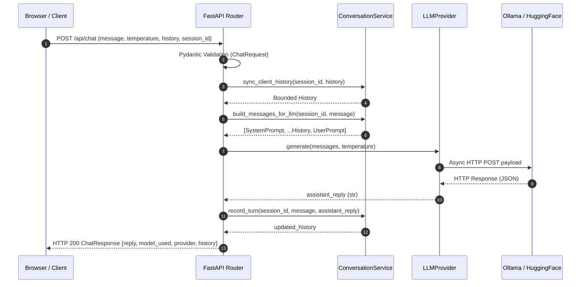

# System Architecture Document

## 1. System Overview
The **LLM Prompt Project** is structured around clean separation of concerns, defensive input validation, pluggable provider abstractions, and bounded conversational state. The architecture isolates HTTP presentation, conversational domain logic, and external inference protocols.

## 2. High-Level Architecture Diagram

```mermaid
flowchart TD
    Client["Browser / HTTP Client"]
    FastAPI["FastAPI Web Layer (app/main.py)"]
    Router["Chat Router (app/routes/chat.py)"]
    ConvService["Conversation Service (app/services/conversation.py)"]
    ProviderFactory["Provider Factory (app/services/llm/__init__.py)"]
    LLMBase["LLMProvider Interface (app/services/llm/base.py)"]
    OllamaProv["Ollama Provider (app/services/llm/ollama.py)"]
    HFProv["HuggingFace Provider (app/services/llm/huggingface.py)"]
    OllamaDaemon["Local Ollama Daemon (:11434)"]
    HFCloud["Hugging Face API Cloud"]

    Client -->|"HTTP GET / (HTML UI)"| FastAPI
    Client -->|"HTTP POST /api/chat (JSON)"| Router
    Client -->|"HTTP GET /health"| Router

    Router -->|"Session & Prompt Assembly"| ConvService
    Router -->|"Resolve Provider"| ProviderFactory
    ProviderFactory --> LLMBase

    LLMBase <|-- OllamaProv
    LLMBase <|-- HFProv

    OllamaProv -->|"Async HTTP /api/chat"| OllamaDaemon
    HFProv -->|"Async HTTP v1/chat/completions"| HFCloud
```

## 3. Component Architecture

### 3.1 Presentation Layer (`app/main.py` & `templates/index.html`)
- **FastAPI Core:** Configures ASGI application, lifespan events, structured logging, and unified exception handlers.
- **Jinja2 Templating:** Serves `templates/index.html` resolved via absolute file paths (`app/config.py`).
- **Browser Client:** Vanilla JavaScript with async `fetch` API, XSS-safe text node rendering, dynamic temperature slider, and live health polling.

### 3.2 Routing & Controller Layer (`app/routes/chat.py`)
- Provides thin HTTP controllers for `POST /api/chat` and `GET /health`.
- Uses FastAPI dependency injection (`Depends`) for decoupled service and provider resolution.
- Enforces HTTP contract translation: maps domain exceptions (`LLMTimeoutError`, `LLMConnectionError`, etc.) to standard RFC-compliant HTTP status codes.

### 3.3 Domain & Conversation Service Layer (`app/services/conversation.py`)
- **State Management:** Thread-safe in-memory session registry backed by `collections.deque(maxlen=MAX_HISTORY_MESSAGES)`.
- **Validation:** Filters client-submitted messages to allowed roles (`user`, `assistant`), strips whitespace, and truncates oversize text payloads.
- **Prompt Templating:** Reads immutable system instructions from `app/prompts/system.txt` with robust runtime fallbacks, stitching system instructions, recent conversation history, and current user prompts.

### 3.4 Provider Abstraction Layer (`app/services/llm/`)
- **Base Interface (`base.py`):** Defines `LLMProvider` abstract base class with `generate()` and `check_health()` signatures, plus domain-specific exceptions.
- **Ollama Adapter (`ollama.py`):** Asynchronous HTTPX client targeting Ollama's local daemon API (`POST /api/chat`, `GET /api/tags`).
- **Hugging Face Adapter (`huggingface.py`):** Asynchronous HTTPX client targeting Hugging Face's OpenAI-compatible chat completions interface with token validation and cold-start handling.
- **Factory (`__init__.py`):** Centralizes instantiation based on runtime configuration (`USE_HF=true|false`).

### 3.5 Configuration Layer (`app/config.py`)
- Centralized immutable settings container (`Settings` dataclass).
- Loads settings from environment variables and `.env` file via `python-dotenv`.
- Ensures zero hardcoded credentials and resolves relative paths to robust absolute system paths.

## 4. End-to-End Request Flow



## 5. Security Architecture
- **Secret Isolation:** API tokens (`HF_TOKEN`) reside purely in server-side environment variables and are never echoed in client responses, logs, or error payloads.
- **Input Sanitization:** String inputs are validated, stripped, and length-capped (`max_length=4000` for prompts; `max_length=10000` for history items).
- **XSS Mitigation:** Frontend relies exclusively on DOM `textContent` assignment rather than `innerHTML` when rendering user and assistant outputs.
- **Non-Root Container:** Docker container execution runs under an unprivileged user (`appuser`, UID 1000).

## 6. Testing Architecture
- Unit tests run completely offline by mocking provider interactions.
- Utilizes FastAPI's `dependency_overrides` and HTTPX's `MockTransport`.
- Decouples continuous integration (CI) environments from live LLM installations.
